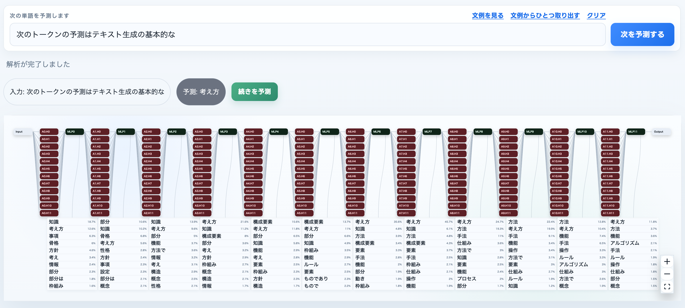

# rinnaLens

`rinna/japanese-gpt2-small` 向けのブラウザ完結型 LogitLens 可視化ツールです。  
ONNX Runtime Web を使いブラウザ内で推論を行うため、起動後のバックエンドサーバは不要です。



**できること**

- 各 Transformer 層の logit lens（語彙射影）
- Attention head クリックで heatmap 表示
- MLP ノードの top-10 トークン候補表示
- Input クリックでトークナイズ結果表示
- `次を予測` ボタンによる連続解析

---

## セットアップ（初回のみ）

Python と uv はモデル変換スクリプトの実行に必要です。アプリの起動には不要です。

```bash
uv sync
```

### 1. トークナイザの変換

```bash
uv run python scripts/export_tokenizer.py
```
→ static/model/tokenizer/ に出力

### 2. モデルの変換

HuggingFace から `rinna/japanese-gpt2-small` をダウンロードし ONNX 形式に変換します。  
ダウンロードと変換を含め数分かかります（出力 ~500 MB）。

```bash
uv run python scripts/export_onnx.py
```
→ static/model/gpt2/ に出力（ONNX チャンク + lm_head.npy + metadata.json）

---

## 起動

任意のWebサーバに static/ 以下のファイルを配置してください。

開発用サーバとして Python の http.server を起動するには、

```bash
uv run app.py
```

と実行して、ブラウザで http://localhost:5055/ を開きます。

初回アクセス時にブラウザがモデルファイル（~500 MB）をロードします。  
ロード完了後はプロンプトを入力して解析できます。

---

## ファイル構成

```
scripts/
  export_onnx.py        ONNX 変換（初回のみ実行）
  export_tokenizer.py   トークナイザ変換（初回のみ実行）
static/
  index.html            メイン UI
  examples              文例
  js/
    app.js              React Flow UI
    engine.js           推論エンジン（ONNX Runtime Web ラッパー）
    tokenizer.js        SentencePiece Unigram トークナイザ
    logit_lens.js       Logit Lens 計算（各層 top-k 予測）
    graph_builder.js    React Flow ノード/エッジデータ生成
  model/
    gpt2/               ONNX モデルファイル（export_onnx.py で生成）
    tokenizer/          トークナイザファイル（export_tokenizer.py で生成）
  vendor/ort/           ONNX Runtime Web（ローカルバンドル済み）
pyproject.toml          変換スクリプト用 Python 依存
```

---

## アーキテクチャ

```
ブラウザ
  │
  ├── tokenizer.js    テキスト → トークン ID（Unigram Viterbi）
  ├── engine.js       ONNX セッション管理・推論・キャッシュ
  │     └── logit_lens.js   hidden_states → 各層 top-k トークン
  ├── graph_builder.js      React Flow ノード/エッジ生成
  └── app.js          UI（React Flow、モーダル、プロンプト入力）
```

バックエンドへの通信は一切ありません。静的ファイルサーバのみ必要です。

---

## スクリプト依存関係

変換スクリプト実行に必要なパッケージ（`pyproject.toml` に記載）：

| パッケージ | 用途 |
|---|---|
| `torch` | モデルロード・ONNX エクスポート |
| `transformers` | `rinna/japanese-gpt2-small` のロード |
| `onnx` / `onnxruntime` / `onnxscript` | ONNX 変換・検証 |
| `sentencepiece` | トークナイザファイル読み込み |

---

## 参照した実装

- https://github.com/Fukata-K/visualize_llm_app
- https://github.com/poloclub/transformer-explainer


## License

MIT
